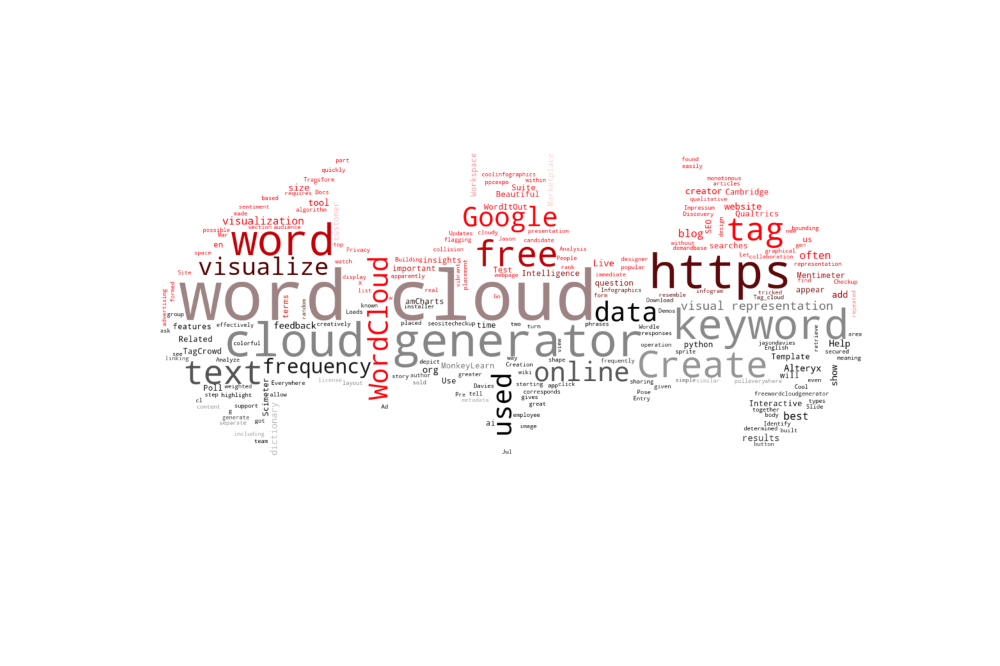

# Keywordcloud generator using AWS Lambda

Use this script to create a word cloud image generator using AWS Lambda and S3.

Lambda trigger: upload background image (png) to s3 bucket


## Set up instructions:

- [ ] Create AWS S3 bucket, create folder for image uploads, create folder for output png files (the word cloud png files generated)
- [ ] Create AWS Lambda Function
- [ ] Install packages in local folder: pip install -r requirements.txt -t ./package
- [ ] cd package
- [ ] zip -r ../keywordcloud-package.zip .
- [ ] cd ..
- [ ] zip keywordcloud-package.zip lambda-function.py
- [ ] Use Lambda console to upload the package zip file to the function's layer
- [ ] (1) Upload a text file to the input bucket eg. logo.txt
- [ ] (2) Upload backgound image png to the input bucket eg. logo.png 
- [ ] (3) Check for output file in the output bucket after the lambda function is done. eg. logo-output.png

If everything is set up correctly you should be able to see an output file with a word cloud every time you upload a new png file. There must be a matching text file with the same name as the png file or the script will look for a default txt file for keywords. The output image file should be in the output bucket/folder.




## IAM Policy for Lambda Function to access S3 and write logs

```
{
    "Version": "2012-10-17",
    "Statement": [
        {
            "Effect": "Allow",
            "Action": [
                "logs:PutLogEvents",
                "logs:CreateLogGroup",
                "logs:CreateLogStream"
            ],
            "Resource": "arn:aws:logs:*:*:*"
        },
        {
            "Effect": "Allow",
            "Action": [
                "s3:GetObject"
            ],
            "Resource": "arn:aws:s3:::keyword-cloud-input/*"
        },
        {
            "Effect": "Allow",
            "Action": [
                "s3:PutObject"
            ],
            "Resource": "arn:aws:s3:::keyword-cloud-output/*"
        }
    ]
}
```

## Planned Integration with website
SEO web tools: [amzto.com](https://amzto.com) -- add python app as micro service (new tool) and integrate in site's menu.

## Credits & Resources:
Special thanks to NeuralNine for the original code base and idea for this project: 
- [Create Fancy Word Clouds in Python - NeuralNine](https://www.youtube.com/watch?v=vRbSnlRyJNQ)
- [Word Cloud in python | Word cloud tutorial](https://www.youtube.com/watch?v=4N_exdTyGHk)

- [AWS Lambda with S3 Trigger Example](https://docs.aws.amazon.com/lambda/latest/dg/with-s3-example.html)
- [Tutorial: Using an Amazon S3 trigger to create thumbnail images with AWS Lambda](https://docs.aws.amazon.com/lambda/latest/dg/with-s3-tutorial.html)

- [Stylecloud tutorial](https://www.youtube.com/watch?v=txPNMDDWsB8)
- [Fontawesome version 5.x](https://github.com/minimaxir/stylecloud)
- [Fontawesome Icons](https://fontawesome.com/icons)